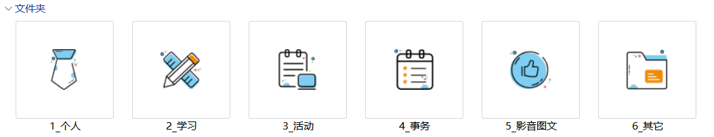

# 网页设计作业
## 设计思路
- 本网页设计思路为将本人笔记本的个人使用盘作为网站的素材。
- 个人使用盘的具体文件分类如下，。

- 以此为基础，共设计了七个网页，分别为：
  - [主页](index.html)
  - [个人介绍](web/self_introduction.html)
  - [学习相关](web/studies.html)
  - [活动相关](web/activities.html)
  - [工作相关](web/works.html)
  - [影音图文](web/viaupicletters.html)
  - [其他内容](web/others.html)
以上。
## 相关特点
1. 从主页跳转，会以新窗口的形式打开，同时，原页面会**播放音乐**。
2. 主页的右下角设置了**切换壁纸**的按钮，点击即可更换壁纸。
3. 在[学习相关-笔记分享](web/viaupicletters.html#笔记分享)中，本想设计html引用markdown的方式，但是由于本人学艺不精，未能实现。
## 作者信息
- 作者：**林夕白告**
- 班级：**霍格沃兹阿卡班**
- 学号：**18480701**